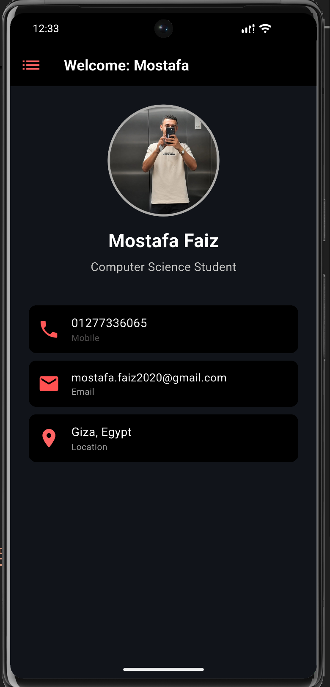

# lec9

A new Flutter project.

## Getting Started

This project is a starting point for a Flutter application.

A few resources to get you started if this is your first Flutter project:

- [Learn Flutter](https://docs.flutter.dev/get-started/learn-flutter)
- [Write your first Flutter app](https://docs.flutter.dev/get-started/codelab)
- [Flutter learning resources](https://docs.flutter.dev/reference/learning-resources)

For help getting started with Flutter development, view the
[online documentation](https://docs.flutter.dev/), which offers tutorials,
samples, guidance on mobile development, and a full API reference.
https://github.com/mostafafaiz2020-byte/TASK-9/blob/main/1.png?raw=true
https://github.com/mostafafaiz2020-byte/TASK-9/blob/d9210251fe96d4b2268f1b734fc38b0e80a3165b/1.png
https://github.com/mostafafaiz2020-byte/TASK-9/blob/c9f0bf1207489d9c2961ad10b1567d5287f523a0/1.png

